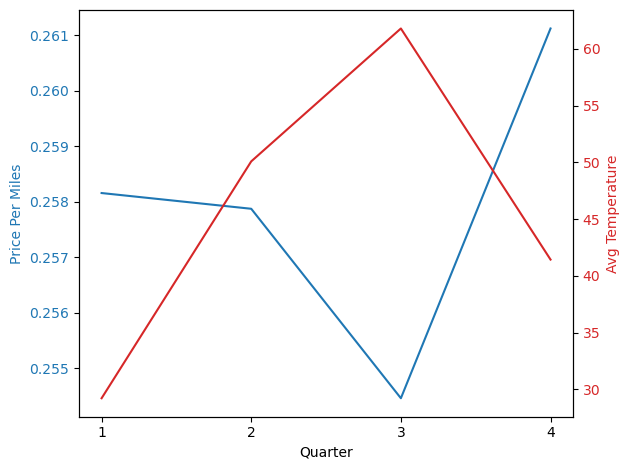

# Colder Days, Cheaper Tickets?

#### Methods of Advanced Data Engineering   
<Pagination classNames="text-gray-300" />

---
layout: table-of-contents
hideInToc: true
---

# Table of Contents

---

# Introduction

<v-clicks>

- **Objective:** Investigate if air travel tickets are cheaper during colder months in North America.

- **Why:** Common advice suggests traveling in winter for cheaper tickets, but is this true?

</v-clicks>

---

# Data Used

<v-clicks>

- **Flight Data:**
  - Source: 2018 Airplane Flights from [Kaggle](https://www.kaggle.com/datasets/behroozbc/average-day-weather-for-2018)
  - Key Columns: `PricePerTicket`, `Miles`, `Quarter`
  - License: CC0: Public Domain
- **Weather Data:**
  - Source: Average day weather for 2018 from [Kaggle](https://www.kaggle.com/datasets/zernach/2018-airplane-flights)
  - Key Columns: `DailyAverageDewPointTemperature`, `DATE`
  - License: CC0: Public Domain

</v-clicks>

---

# Methodology

<v-clicks>

1. **Data Preparation:** 
    - Download the datasets from Kaggle.
2. **Mapping:** 
    - Mapped weather data to flight quarters.
3. **Analysis:** 
    - Calculated average temperature and price per mile for each quarter.

</v-clicks>
 
<v-click>

</v-click>

---

# Pipeline Details

<v-clicks>

1. **Data Downloading:** 
    - The Kaggle package download the datasets from the Kaggle.
2. **Data Cleaning:** 
    - The datasets are clear which I did not implement this part.
3. **Feature Mapping:**
    - Converted 'DATE' from weather data to match 'Quarter' in flight data for integration.
4. **Aggregation:**
    - Computed average temperature and price per mile by quarter to match data.
5. **Output Generation:**
    - Produced a new dataset with 'AvgTemperature', 'PricePerMiles', and 'Quarter' as features.
6. **Save**:
      - CSV file selected to store the output of pipeline because it produces a few rows as output.
</v-clicks>

---

# Analysis Method

<v-clicks depth=2>

- **Correlation Analysis:** 
  - **Method:** Pearson Correlation Coefficient (PCC).
- **Pearson Correlation Coefficient (PCC):**
  - **What is PCC?** 
    - A measure of the linear correlation between two sets of data.
  - **Range:** 
    - Values range from -1 to 1.
  - **Interpretation:**
    - **1:** Perfect positive correlation
    - **-1:** Perfect negative correlation
    - **0:** No correlation

</v-clicks>

---

# Pearson Correlation Coefficient Formula

<v-clicks depth=2>

- **Formula:**
  - $r=\frac{\sum_{i=1}^n (X_i-\bar{X})(Y_i-\bar{Y})}{\sqrt{\sum_{i=1}^n (X_i-\bar{X})^2 \cdot \sum_{i=1}^n (Y_i-\bar{Y})^2}}$
  - Where $X$ and $Y$ are the two variables, $\bar{X}$ and $\bar{Y}$ are their means, and $n$ is the number of observations.
- **Use Case:**
  - Ideal for determining if changes in temperature directly relate to changes in ticket prices.

</v-clicks>

---

# Correlation Analysis Results

<v-clicks>

- **Pearson Correlation Coefficient:** 
  - **Result:** -0.65, indicating an inverse relationship between temperature and price per mile.
  - **Implication:** As temperature decreases, ticket prices per mile tend to increase.
  
</v-clicks>
<v-click>

</v-click>
---

# Conclusions

<v-click>

- **Finding:** Contrary to popular belief, colder temperatures correlate with higher ticket prices.
</v-click>
<v-clicks>

- **Results:**
  - **PCC Value:** -0.65, suggesting a moderate to strong negative correlation.
  - **Temperature Impact:** Colder days are linked with higher flight costs.
- **Implications:**
  - **Travel Planning:** Winter might not be the best time for budget travel in North America.
  - **Market Dynamics:** Higher demand or operational costs during colder months could explain this trend.
- **Reasons:**
  - Winter holidays increase travel demand.
  - Tourism patterns shift (cold to warm, warm to cold for winter sports).
  - Additional operational costs in winter (de-icing).

</v-clicks>

---

# Limitations

<v-clicks>

- **Data Granularity:** Data by quarter, not by month or day, which might miss short-term fluctuations.

- **Holiday Effects:** No consideration for public or school holidays which influence price.

</v-clicks>

---

# Future Work

<v-clicks>

- **Enhance Data:** Monthly or daily flight data for more precision.

- **Include Holidays:** Incorporate holidays as variables in analysis.

- **Operational Costs:** Investigate how operational costs affect pricing.

</v-clicks>

---
class: text-center
---

# Thank You for your attention.

 **Questions?** 
